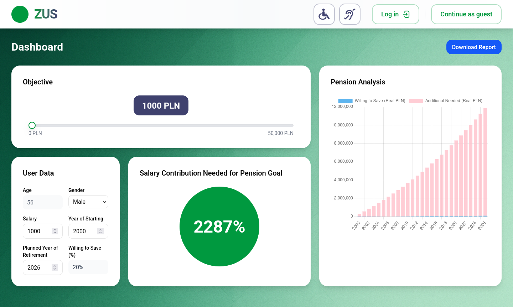
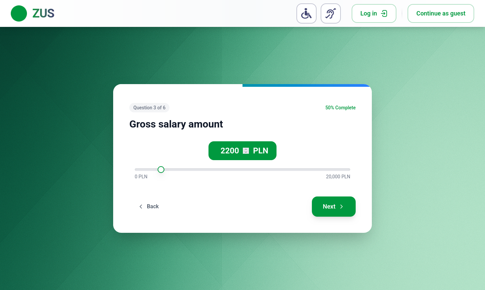
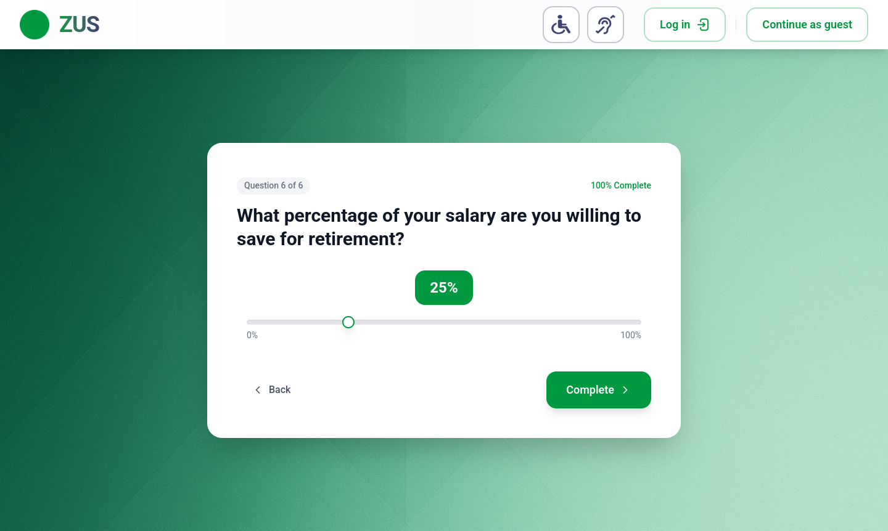
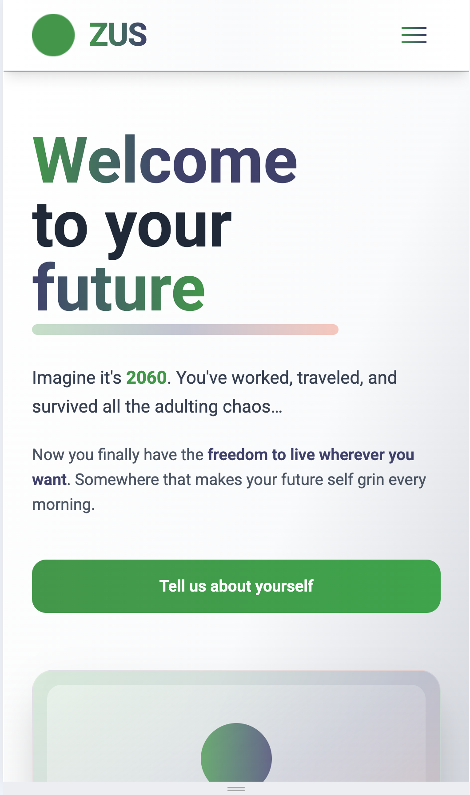

# Retirement Simulator — HackYeah 2025

A fast demo for the ZUS retirement challenge: answer a short quiz, see your personalised pension outlook, and tweak the plan instantly.



## Quick Links
- Live app: https://hackyeah-phi.vercel.app/
- Backend API (demo): https://carless-margarete-counterattractive.ngrok-free.dev/
- Pitch deck & video: _add links before submission_



## What It Does
- Captures key inputs (age, salary, career span, savings appetite) in under a minute.
- Runs projections using ZUS / GUS / NBP assumptions to show nominal vs real pension, replacement rate, and delay scenarios.
- Surfaces guidance, trivia, and ZUS accessibility links with a responsive, WCAG-minded UI.



## Run Locally
```bash
# backend
cd backend
cp .env.example .env   # set DATABASE_URL
npm install && npx prisma migrate deploy && npm run start:dev

# frontend
cd ../frontend
npm install && npm run dev -- --host 0.0.0.0 --port 5173
```
Update `frontend/src/shared/api/instance.ts` if your backend URL changes.



## Tech Stack
React 19 · Vite · Tailwind CSS · Zustand · Chart.js · NestJS 11 · Prisma · PostgreSQL

## Team & License
LifeRun / Memento — list members & roles here. Licensed MIT. If we win, we agree to the organiser’s IP transfer terms.
